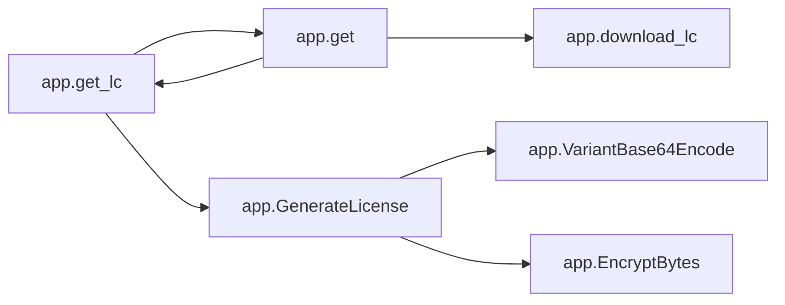
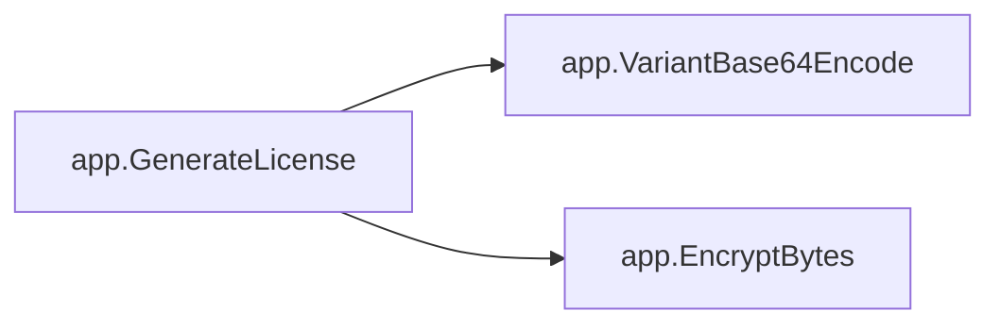
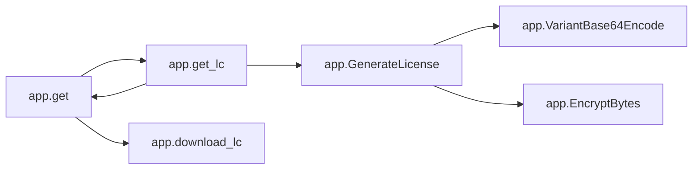

# Key Objects

[_Documentation generated by Documatic_](https://www.documatic.com)

<!---Documatic-section-app.index-start--->
## app.index

<!---Documatic-section-index-start--->
<!---Documatic-block-app.index-start--->
<details>
	<summary><code>app.index</code> code snippet</summary>

```python
@app.route('/')
def index():
    return send_file('index.html')
```
</details>
<!---Documatic-block-app.index-end--->
<!---Documatic-section-index-end--->

# #
<!---Documatic-section-app.index-end--->

<!---Documatic-section-app.download_lc-start--->
## app.download_lc

<!---Documatic-section-download_lc-start--->
<!---Documatic-block-app.download_lc-start--->
<details>
	<summary><code>app.download_lc</code> code snippet</summary>

```python
def download_lc(lc):
    if lc and len(lc) > 5 and os.path.exists('./' + lc):
        return send_file(lc, as_attachment=True, attachment_filename='Custom.mxtpro')
    else:
        return '请检查用户名版本号是否正确！'
```
</details>
<!---Documatic-block-app.download_lc-end--->
<!---Documatic-section-download_lc-end--->

# #
<!---Documatic-section-app.download_lc-end--->

<!---Documatic-section-app.DecryptBytes-start--->
## app.DecryptBytes

<!---Documatic-section-DecryptBytes-start--->
<!---Documatic-block-app.DecryptBytes-start--->
<details>
	<summary><code>app.DecryptBytes</code> code snippet</summary>

```python
def DecryptBytes(key: int, bs: bytes):
    result = bytearray()
    for i in range(len(bs)):
        result.append(bs[i] ^ key >> 8 & 255)
        key = bs[i] & key | 18477
    return bytes(result)
```
</details>
<!---Documatic-block-app.DecryptBytes-end--->
<!---Documatic-section-DecryptBytes-end--->

# #
<!---Documatic-section-app.DecryptBytes-end--->

<!---Documatic-section-app.VariantBase64Encode-start--->
## app.VariantBase64Encode

<!---Documatic-section-VariantBase64Encode-start--->
<!---Documatic-block-app.VariantBase64Encode-start--->
<details>
	<summary><code>app.VariantBase64Encode</code> code snippet</summary>

```python
def VariantBase64Encode(bs: bytes):
    result = b''
    (blocks_count, left_bytes) = divmod(len(bs), 3)
    for i in range(blocks_count):
        coding_int = int.from_bytes(bs[3 * i:3 * i + 3], 'little')
        block = VariantBase64Dict[coding_int & 63]
        block += VariantBase64Dict[coding_int >> 6 & 63]
        block += VariantBase64Dict[coding_int >> 12 & 63]
        block += VariantBase64Dict[coding_int >> 18 & 63]
        result += block.encode()
    if left_bytes == 0:
        return result
    elif left_bytes == 1:
        coding_int = int.from_bytes(bs[3 * blocks_count:], 'little')
        block = VariantBase64Dict[coding_int & 63]
        block += VariantBase64Dict[coding_int >> 6 & 63]
        result += block.encode()
        return result
    else:
        coding_int = int.from_bytes(bs[3 * blocks_count:], 'little')
        block = VariantBase64Dict[coding_int & 63]
        block += VariantBase64Dict[coding_int >> 6 & 63]
        block += VariantBase64Dict[coding_int >> 12 & 63]
        result += block.encode()
        return result
```
</details>
<!---Documatic-block-app.VariantBase64Encode-end--->
<!---Documatic-section-VariantBase64Encode-end--->

# #
<!---Documatic-section-app.VariantBase64Encode-end--->

<!---Documatic-section-app.get_lc-start--->
## app.get_lc

<!---Documatic-section-get_lc-start--->


### Object Calls

* app.get
* app.GenerateLicense

<!---Documatic-block-app.get_lc-start--->
<details>
	<summary><code>app.get_lc</code> code snippet</summary>

```python
def get_lc():
    name = request.args.get('name', '')
    version = request.args.get('ver', '')
    count = int(request.args.get('count', '1'))
    try:
        (MajorVersion, MinorVersion) = version.split('.')[0:2]
    except:
        return
    MajorVersion = int(MajorVersion)
    MinorVersion = int(MinorVersion)
    lc = GenerateLicense(LicenseType.Professional, count, name, MajorVersion, MinorVersion)
    return lc
```
</details>
<!---Documatic-block-app.get_lc-end--->
<!---Documatic-section-get_lc-end--->

# #
<!---Documatic-section-app.get_lc-end--->

<!---Documatic-section-app.EncryptBytes-start--->
## app.EncryptBytes

<!---Documatic-section-EncryptBytes-start--->
<!---Documatic-block-app.EncryptBytes-start--->
<details>
	<summary><code>app.EncryptBytes</code> code snippet</summary>

```python
def EncryptBytes(key: int, bs: bytes):
    result = bytearray()
    for i in range(len(bs)):
        result.append(bs[i] ^ key >> 8 & 255)
        key = result[-1] & key | 18477
    return bytes(result)
```
</details>
<!---Documatic-block-app.EncryptBytes-end--->
<!---Documatic-section-EncryptBytes-end--->

# #
<!---Documatic-section-app.EncryptBytes-end--->

<!---Documatic-section-app.GenerateLicense-start--->
## app.GenerateLicense

<!---Documatic-section-GenerateLicense-start--->


### Object Calls

* app.VariantBase64Encode
* app.EncryptBytes

<!---Documatic-block-app.GenerateLicense-start--->
<details>
	<summary><code>app.GenerateLicense</code> code snippet</summary>

```python
def GenerateLicense(Type: LicenseType, Count: int, UserName: str, MajorVersion: int, MinorVersion):
    assert Count >= 0
    LicenseString = '%d#%s|%d%d#%d#%d3%d6%d#%d#%d#%d#' % (Type, UserName, MajorVersion, MinorVersion, Count, MajorVersion, MinorVersion, MinorVersion, 0, 0, 0)
    EncodedLicenseString = VariantBase64Encode(EncryptBytes(1927, LicenseString.encode())).decode()
    FileName = EncodedLicenseString.replace('/', '').replace('\\', '')
    with zipfile.ZipFile(FileName, 'w') as f:
        f.writestr('Pro.key', data=EncodedLicenseString)
    return FileName
```
</details>
<!---Documatic-block-app.GenerateLicense-end--->
<!---Documatic-section-GenerateLicense-end--->

# #
<!---Documatic-section-app.GenerateLicense-end--->

<!---Documatic-section-app.get-start--->
## app.get

<!---Documatic-section-get-start--->


### Object Calls

* app.get_lc
* app.download_lc

<!---Documatic-block-app.get-start--->
<details>
	<summary><code>app.get</code> code snippet</summary>

```python
@app.route('/gen')
def get():
    lc = get_lc()
    return download_lc(lc)
```
</details>
<!---Documatic-block-app.get-end--->
<!---Documatic-section-get-end--->

# #
<!---Documatic-section-app.get-end--->

<!---Documatic-section-app.VariantBase64Decode-start--->
## app.VariantBase64Decode

<!---Documatic-section-VariantBase64Decode-start--->
<!---Documatic-block-app.VariantBase64Decode-start--->
<details>
	<summary><code>app.VariantBase64Decode</code> code snippet</summary>

```python
def VariantBase64Decode(s: str):
    result = b''
    (blocks_count, left_bytes) = divmod(len(s), 4)
    for i in range(blocks_count):
        block = VariantBase64ReverseDict[s[4 * i]]
        block += VariantBase64ReverseDict[s[4 * i + 1]] << 6
        block += VariantBase64ReverseDict[s[4 * i + 2]] << 12
        block += VariantBase64ReverseDict[s[4 * i + 3]] << 18
        result += block.to_bytes(3, 'little')
    if left_bytes == 0:
        return result
    elif left_bytes == 2:
        block = VariantBase64ReverseDict[s[4 * blocks_count]]
        block += VariantBase64ReverseDict[s[4 * blocks_count + 1]] << 6
        result += block.to_bytes(1, 'little')
        return result
    elif left_bytes == 3:
        block = VariantBase64ReverseDict[s[4 * blocks_count]]
        block += VariantBase64ReverseDict[s[4 * blocks_count + 1]] << 6
        block += VariantBase64ReverseDict[s[4 * blocks_count + 2]] << 12
        result += block.to_bytes(2, 'little')
        return result
    else:
        raise ValueError('Invalid encoding.')
```
</details>
<!---Documatic-block-app.VariantBase64Decode-end--->
<!---Documatic-section-VariantBase64Decode-end--->

# #
<!---Documatic-section-app.VariantBase64Decode-end--->

[_Documentation generated by Documatic_](https://www.documatic.com)